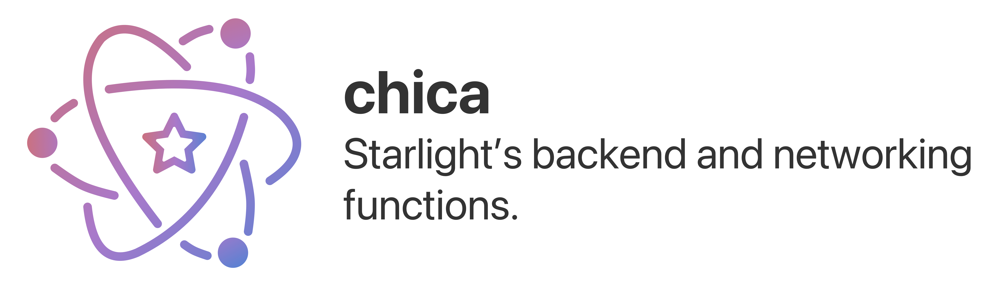

 
    

# Index

<!-- Pages -->
[qsp]: #quick-start-%EF%B8%8F
[bfs]: #building-from-source
[spm]: #through-swift-package-manager
[wcidwi]: #what-can-i-do-with-it
[licensing]: #licensing
[cntrbtn]: #contributions

<!-- Links -->
- [Quick Start 🏃‍♂️][qsp]
    - [Building from source][bfs]
    - [Through Swift Package Manager][spm]
- [What can I do with it?][wcidwi]
- [Licensing][licensing]
- [Contributions][cntrbtn]

## Quick Start 🏃‍♂️

> :warning: The following source code is highly experimental and has been designed in a version of Swift that is still in beta, which will result in this code changing over time. The following code may or may not result in a final product shipped to consumers.

While `chica` is just [starlight][starlight]'s backend put into a separated swift package, you can still import it to your project if you want to work with Mastodon and Twitter endpoints. Think of it as a Twitter + Mastodon API for Swift 5.5, that takes advantage of the new concurrency model.

`chica` can be installed via the Swift Package Manager, or built from source.

### Building from source

To build `chica`, you'll need the following:

- A Mac running macOS 12 (Monterey) or later
- Xcode 13 or higher
- [SwiftLint][sl]

Download the repository code using `gh repo clone` or opening directly in Xcode via GitHub and press the "Run" button to build and run the app. Targets can be changed to reflect the appropriate device to target.

### Through Swift Package Manager

In Xcode 13, go to `File > Swift Packages > Add Package Dependency...`, then paste in `https://github.com/hyperspacedev/chica`

Now just `import Chica`, and you're ready to go!

## What can I do with it?

- **Build apps that interact with Mastodon or Twitter —** `chica` was initially built for [starlight][starlight], but we decided to make it a separate package so that it can be reused for several projects. Are you working on an app that may require to show embed tweets or toots? We've got you covered.

- **Learn how the new concurrency model works —** The main benefit of being open-source is that the code is, well, open – and everybody can check it and even contribute to it. Thanks to this, `chica` can serve as a guide for people who want to see some real-examples of the new async/await features introduced by Apple in Swift 5.5.

- **Build tools that leverage the Fediverse or Twitter —** There is no reason why `chica` should only be limited for building apps: it can be used for everything! You can use it for building command line interfaces that interact with these social networks, or you can build a bot that automatically toots whatever you post on twitter (or vice-versa); who knows what beatiful things you can achieve with this!

Found a novel use? We'd love to hear about it!

## Licensing

Codename Starlight and its respective subprojects are licensed under the Non-Violent Public License, the same license used in Hyperspace Desktop. This is a semi-permissive license that allows modifications and redistributions as long as the software is not used to harm another person or cause conflict. You can read your rights in the attached [LICENSE][license] file.

## Contributions

Contribution guidelines are available in the [contributing file][cf] and when you make an issue/pull request. Additionally, you can access our [Code of Conduct][coc].

If you want to aid the project in other ways, consider supporting the project on [Patreon](https://patreon.com/hyperspacedev).

<!-- Links -->
[starlight]: https://github.com/hyperspacedev/starlight
[sl]: https://github.com/realm/swiftlint
[ptrn]: https://patreon.com/hyperspacedev

<!-- Files -->
[license]: LICENSE.txt
[cf]: .github/contributing.md
[coc]: .github/CODE_OF_CONDUCT.md
